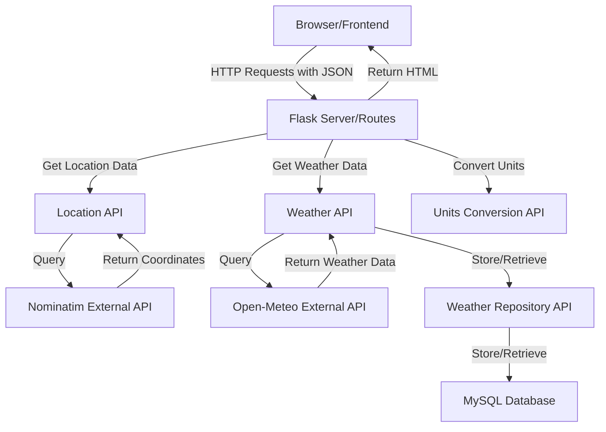

# Project Plan: Weather Dashboard Application

## 1. Project Overview

The Weather Dashboard is a web application built with Python and Flask that allows users to view current weather conditions and forecasts. The application integrates with Open-Meteo for weather data and Nominatim for geocoding, focusing on delivering accurate weather information through a simple, user-friendly interface. This project serves as a platform for implementing and demonstrating software quality assurance practices.

## 2. Technical Architecture

### Application Structure

### Internal APIs

1. **Weather API**

   - Purpose: Interface with Open-Meteo external API
   - Responsibilities: Request weather data, determine if cached data is expired, process results
   - Implementation: Python class that handles weather-specific operations

2. **Location API**

   - Purpose: Handle location processing and geocoding
   - Responsibilities: Convert location names/zip codes to coordinates using Nominatim
   - Implementation: Python class for location-related operations

3. **Weather Repository API**

   - Purpose: Data persistence and storage
   - Responsibilities: Store and retrieve weather data with timestamps
   - Implementation: Repository pattern for database operations

4. **Units Conversion API**
   - Purpose: Handle measurement unit conversions
   - Responsibilities: Convert between different units (Celsius/Fahrenheit, km/h/mph, mm/inches, etc)
   - Implementation: Service for transforming data between unit systems based on user preferences

### External APIs

1. **Open-Meteo API**

   - Weather data provider (current, hourly, and 7-day forecast)
   - Endpoint: `https://api.open-meteo.com/v1/forecast`
   - Communication: GET requests with query parameters

2. **Nominatim API**
   - Geocoding service (converts location names to coordinates)
   - Endpoint: `https://nominatim.openstreetmap.org/search`
   - Communication: GET requests with query parameters

### Component Description

1. **Frontend**: HTML, CSS, and JavaScript for interactive elements
2. **Backend Server**: Flask application handling routing, API integration, data processing, and HTML rendering
3. **Database**: MySQL relational database with SQLAlchemy ORM for storing cached weather data
4. **Template Engine**: Jinja2 integrated with Flask for rendering HTML templates

## 3. Technical Implementation Details

### Communication

- **Frontend to Backend**: HTTP requests with JSON data
- **Internal API Components**: Direct Python method calls with native objects
- **Backend to External APIs**: HTTP GET requests with query parameters
- **Data Persistence**: Relational data stored in MySQL via SQLAlchemy ORM

### Data Flow

1. User enters location (city name, zip cod)
2. Flask routes receive request
3. Location API converts location to coordinates using Nominatim if needed
4. Weather API checks if weather data is cached and still valid
5. If cache is valid, data is retrieved from repository
6. If cache is expired or missing, Weather API requests data from Open-Meteo
7. New data is processed and stored in repository
8. Units Conversion API transforms data to user's preferred units
9. Flask routes render appropriate template with weather data
10. HTML response is sent to user's browser

### Caching Strategy

- Weather API will determine if cached data is expired based on these timeframes:
  - Current weather: Valid for 5 minutes
  - Hourly forecast: Valid for 15 minutes
  - 7-day forecast: Valid for 1 hour

### Page Structure

1. **Home/Search Page**: Initial page for location input
2. **Weather Dashboard Page**: Displays current conditions and 7-day forecast
3. **Hourly Details Page**: Shows hour-by-hour breakdown for selected day

## 4. High-Level Project Timeline

### Sprint 1 (2/26/25 - 3/11/25)

**Focus: Project Initialization and API Exploration**

- Repository setup and initial project structure
- Project Charter development
- Initial API exploration with Open-Meteo
- Basic backend structure implementation

### Sprint 2 (3/12/25 - 4/1/25, Includes Spring Break)

**Focus: Core API Integration and Backend Foundation**

- Backend API integration with Open-Meteo
- Implement Nominatim geocoding
- Implement Repository pattern for data caching
- Begin basic HTML templates

### Sprint 3 (4/2/25 - 4/15/25)

**Focus: Frontend Development and Integration**

- Frontend development
- Implement multi-page navigation
- Connect frontend with backend
- Testing foundations

### Sprint 4 (4/16/25 - 4/29/25)

**Focus: Testing and Educational Labs**

- Complete required testing
- Develop educational labs
- Final documentation and presentation

## 5. Testing Approach

The project will implement comprehensive testing to achieve 70-80% test coverage as required:

- **Unit Testing**: Test individual API components using Pytest
- **API Testing**: Test external API integration using Postman/Requests
- **UI Testing**: Test user interface using Selenium and/or Playwright
- **Acceptance Testing**: Test end-to-end scenarios using Robot Framework

A detailed Test Plan will be developed separately to outline specific testing strategies and coverage targets.

## 6. Educational Labs

Four educational labs will be developed to demonstrate different testing approaches:

1. **Unit Testing Lab with Pytest**
2. **API Testing Lab with Postman/Requests**
3. **UI Testing Lab with Selenium/Playwright**
4. **Acceptance Testing Lab with Robot Framework**

Detailed lab content will be developed during Sprint 4.

## 7. Risk Management

### Identified Risks

1. **API Rate Limiting**: Open-Meteo and Nominatim have usage limits

   - **Mitigation**: Implement effective caching to reduce API calls

2. **Team Capacity**: Small team with limited specialized roles

   - **Mitigation**: Focus on core requirements first

3. **Technical Challenges**: Integration of multiple testing frameworks

   - **Mitigation**: Early proof-of-concept testing

4. **Timeline Constraints**: Limited time to complete all requirements
   - **Mitigation**: Prioritize features, maintain regular progress tracking

## 8. Success Metrics

The project will be considered successful when:

- All required features are implemented and functional
- Test coverage reaches 70-80% across components
- Educational labs demonstrate testing methodologies
- Documentation is comprehensive and clear
- The application correctly displays weather data
