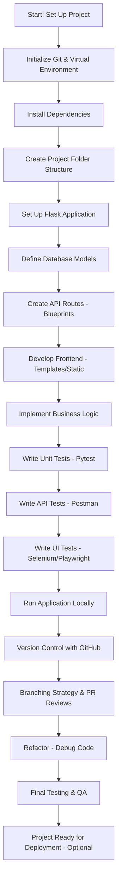
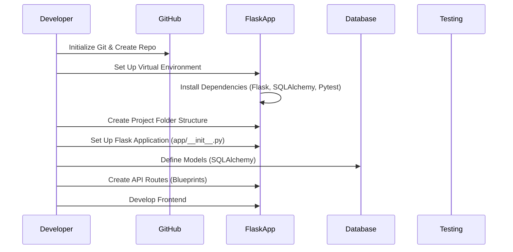
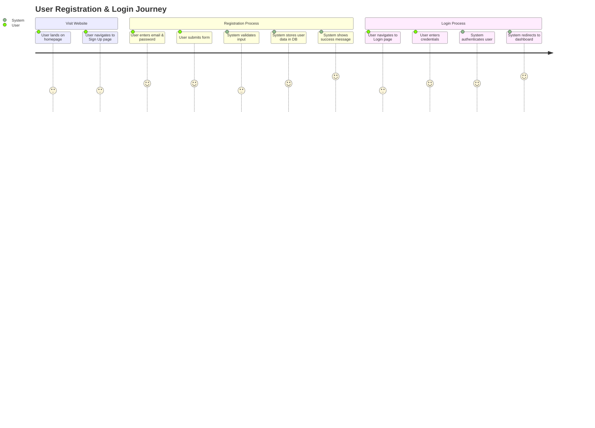

# Mermaid Examples

## Architecture (Layered)

## Architecture

## User Journey

Here is a **User Story** for a Flask web application following the **Layered (n-Tier) Architecture** that can be demonstrated using a **Mermaid User Journey Diagram**.

---

### **User Story: User Registration & Login**

#### **Title:** User can register and log into the Flask web application.

#### **Actors:** New User, System (Flask App)

#### **Description:**

As a **new user**,  
I want to **create an account and log in**,  
So that I can **access personalized content**.

#### **Acceptance Criteria:**

✅ User can access the **registration page**.  
✅ User can **submit a valid email and password** for account creation.  
✅ System **validates input and stores user data** in the database.  
✅ User receives a **success message** and can log in.  
✅ Upon logging in, the system **authenticates and redirects** the user to the dashboard.

---

### **Mermaid User Journey Diagram**

---

### **How to Demo This User Story**

1. **Homepage & Navigation:** Show how the user reaches the registration page.
2. **Registration Form:** Demonstrate how the user enters their details and submits the form.
3. **Validation & Storage:** Simulate how the system checks input and stores data.
4. **Login Flow:** Show the user logging in with their credentials and accessing the dashboard.
5. **Redirect & Authentication:** Highlight how the system verifies login details and grants access.

---
